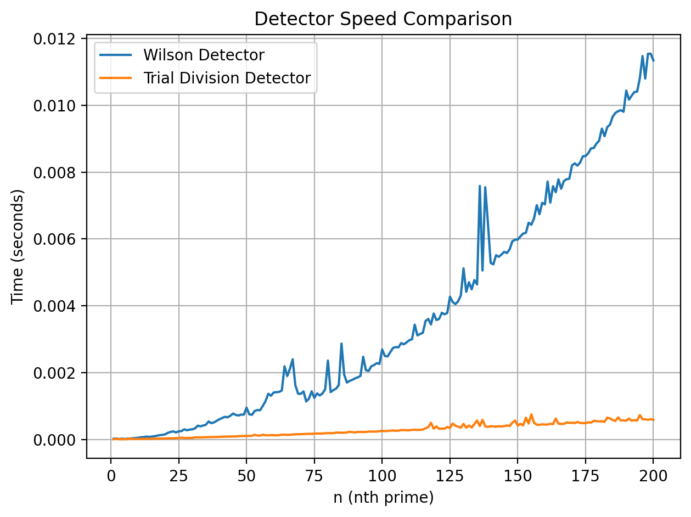

# Willans Prime Generator

This repository implements a computational version of **Willans’ formula** for determining the *nth prime number*.  
Instead of evaluating the original symbolic expression, the method reconstructs Willans’ prime-indexing behavior using:

- A **primality detector**  
- A **prime-counting accumulator**  
- A **termination condition** when the nth prime is reached  

Two detectors are implemented:

1. **Trial Division Detector** — the recommended, efficient method  
2. **Wilson’s Theorem Detector** — mathematically interesting but significantly slower  

A benchmarking script compares both detectors and produces a timing graph.

---

# Mathematical Basis

## Willans’ Prime Index Structure

The nth prime \( p_n \) satisfies the following Willans-style expression:

\[
p_n 
= 
1 +
\sum_{m=1}^{2^n}
\mathbf{1}\!\left\{
1 + \sum_{j=1}^{m} P(j) \le n
\right\}
\]

where:

- \( P(j) \in \{0,1\} \) is a primality indicator  
- \( \sum_{j=1}^m P(j) = \pi(m) \) is the prime counting function  
- The indicator remains \(1\) while \( \pi(m) < n \), and becomes \(0\) when \( \pi(m) = n \)

Thus \( p_n \) is the smallest integer for which:

\[
\pi(p_n) = n.
\]

To evaluate this numerically, we substitute a computational primality test for \( P(j) \).

---

# Trial Division Primality Detector (Recommended)

## Mathematical Foundation

The trial division test relies on the fact:

\[
n \text{ is prime}
\iff
n > 1
\;\wedge\;
\neg\exists d \in [2, \sqrt{n}] : d \mid n.
\]

This follows from the factorization property:

\[
n = ab 
\;\Rightarrow\;
\min(a, b) \le \sqrt{n}.
\]

Hence, checking divisibility only up to \( \sqrt{n} \) is sufficient for perfect correctness.

---

## Detector Definition

Let \( T(n) \) denote the trial-division primality indicator:

\[
T(n) =
\begin{cases}
0, & n \le 1, \\[4pt]
1, & n = 2, \\[4pt]
0, & n > 2 \text{ and } n \equiv 0 \pmod 2, \\[6pt]
1, & \text{no odd divisor } d \le \sqrt{n} \text{ divides } n, \\[4pt]
0, & \text{otherwise}.
\end{cases}
\]

This detector is:

- Deterministic  
- Exact for all integers  
- Efficient for all practical values of \( n \)

---

## Why Trial Division Is Much Faster

Wilson's theorem requires evaluating:

\[
(n-1)! \bmod n,
\]

which has worst-case cost \( O(n) \) modular multiplications per test.

Trial division requires checking only up to \( \sqrt{n} \):

\[
O(\sqrt{n}).
\]

Furthermore:

- Half the integers are eliminated immediately as even  
- Many composites have small factors  
- Only primes require checking up to \( \sqrt{n} \)

In practice, trial division is **more than an order of magnitude faster** than Wilson's method, as confirmed by the benchmark graph.

---

# Wilson’s Theorem Detector (For Reference Only)

Wilson’s theorem states:

\[
n \text{ is prime}
\iff
(n - 1)! \equiv -1 \pmod n.
\]

The associated indicator is:

\[
W(n) =
\begin{cases}
1, & (n-1)! + 1 \equiv 0 \pmod n,\\[4pt]
0, & \text{otherwise}.
\end{cases}
\]

While mathematically elegant, the factorial growth makes it computationally expensive, even with modular reduction.  
This detector is included for completeness but is not recommended for use.

---

# Modified Willans Prime Computer

The prime generator uses a cumulative counting process:

\[
\pi(m) = \sum_{j=1}^m P(j),
\]

and produces:

\[
p_n =
\sum_{m=1}^{B(n)}
\mathbf{1}\!\left\{
1 + \pi(m) \le n
\right\},
\]

terminating as soon as:

\[
\pi(m) = n.
\]

Here \( B(n) \) is a safe upper search bound.  
The classical Willans bound \( 2^n \) is used for structural fidelity, but other bounds may be substituted when using faster detectors like trial division.

---

# Benchmark Results

The benchmarking script compares:

- Trial Division Detector  
- Wilson Detector  

and measures the time to compute successive values of \( n \).

The resulting graph:

**Observations:**

- Trial division grows slowly and steadily.  
- Wilson’s method grows quickly and exhibits spikes due to modular factorial operations.  
- For all \( n \) tested, trial division is far more efficient.

---

# Summary

- Willans’ structure provides a mathematically elegant way to compute prime indices.  
- The choice of \( P(j) \) (primality detector) dramatically affects performance.  
- **Trial division** is deterministic, simple, and significantly faster than Wilson’s theorem.  
- The modified Willans prime computer implemented here is efficient up to moderately large values of \( n \).  

This repository demonstrates how classical number theory and practical primality testing can be combined into a unified prime computation framework.

